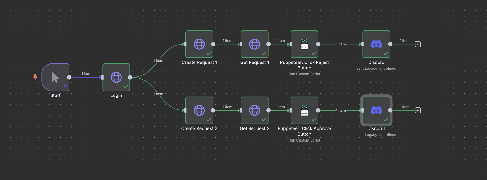

### Run n8n using docker:

- `docker volume create n8n_data`
- `docker run -it --rm --name n8n -p 5678:5678 -v n8n_data:/home/node/.n8n docker.n8n.io/n8nio/n8n`
- To make the puppeteer work
  - Donwload the community node: `n8n-nodes-puppeteer`
  - Go to settings and search for the community node and install
  - This doesn't work properly as puppeteer needs to be setup properly

### Run n8n using docker with puppeteer:

- https://www.npmjs.com/package/n8n-nodes-puppeteer
- Clone the repository: `git clone git@github.com:drudge/n8n-nodes-puppeteer.git`
  > (Moved docker file directly to this repo, we dont have to clone this.)
- build the docker image: `docker build -t n8n-puppeteer -f docker/Dockerfile docker/`
- run the docker image:
  ```
  docker run -it \
      -p 5678:5678 \
      -v ~/.n8n:/home/node/.n8n \
      n8n-puppeteer
  ```
- While working with the puppeteer node make sure to add the following option:
  - enable: `Add Container Arguments`
- To run the custom script in the puppeteer node:

```
// Navigate to page
await $page.goto('{{ $('Start').item.json.base_url }}/approval?requestId={{ $('Create Request').item.json.request.id }}&token={{ $('Login').item.json.token }}');

// Step 2: Wait for the "Approve" button using its ID
await $page.waitForSelector('#btn-approve', { timeout: 10000 });

// Step 3: Click the "Approve" button
await $page.click('#btn-approve');

// Step 4: Delay for 2 seconds to let the UI settle
await new Promise(resolve => setTimeout(resolve, 2000));

// Step 4: Wait for UI update or confirmation
//await $page.waitForTimeout(2000); // Adjust if there's a post-approval animation or redirect

// Step 5: Take a screenshot
const screenshot = await $page.screenshot({
  type: 'png',
  fullPage: true,
  encoding: 'base64',
});

// Step 6: Return the screenshot as base64
return [
  {
    binary: {
      screenshot: {
        data: screenshot,
        mimeType: "image/png",
        fileName: "screenshot.png",
      },
    },
  },
];
```

---

Complete example workflow:

```
{
  "nodes": [
    {
      "parameters": {
        "method": "POST",
        "url": "={{$node[\"Start\"].json[\"base_url\"]}}/login",
        "sendBody": true,
        "bodyParameters": {
          "parameters": [
            {
              "name": "username",
              "value": "alice"
            },
            {
              "name": "password",
              "value": "password123"
            }
          ]
        },
        "options": {
          "redirect": {
            "redirect": {
              "maxRedirects": 1
            }
          },
          "response": {
            "response": {
              "responseFormat": "json"
            }
          }
        }
      },
      "type": "n8n-nodes-base.httpRequest",
      "typeVersion": 4.2,
      "position": [
        -200,
        -80
      ],
      "id": "72cd174b-8f83-4a42-8a1f-26596c6a5004",
      "name": "Login"
    },
    {
      "parameters": {},
      "type": "n8n-nodes-base.manualTrigger",
      "typeVersion": 1,
      "position": [
        -420,
        -80
      ],
      "id": "d4d62f47-f584-4c0c-9373-dd9944b277c7",
      "name": "Start"
    },
    {
      "parameters": {
        "method": "POST",
        "url": "={{$node[\"Start\"].json[\"base_url\"]}}/requests",
        "sendHeaders": true,
        "headerParameters": {
          "parameters": [
            {
              "name": "Authorization",
              "value": "=Bearer {{$node[\"Login\"].json[\"token\"]}}"
            }
          ]
        },
        "sendBody": true,
        "bodyParameters": {
          "parameters": [
            {
              "name": "itemName",
              "value": "car"
            }
          ]
        },
        "options": {
          "redirect": {
            "redirect": {}
          },
          "response": {
            "response": {
              "responseFormat": "json"
            }
          }
        }
      },
      "type": "n8n-nodes-base.httpRequest",
      "typeVersion": 4.2,
      "position": [
        20,
        -80
      ],
      "id": "69447a38-17cb-466a-a22b-a1765f455e24",
      "name": "Create Request"
    },
    {
      "parameters": {
        "url": "={{$node[\"Start\"].json[\"base_url\"]}}/requests/{{$node[\"Create Request\"].json[\"request\"][\"id\"]}}",
        "sendHeaders": true,
        "headerParameters": {
          "parameters": [
            {
              "name": "Authorization",
              "value": "=Bearer {{$node[\"Login\"].json[\"token\"]}}"
            }
          ]
        },
        "options": {
          "redirect": {
            "redirect": {}
          },
          "response": {
            "response": {
              "responseFormat": "json"
            }
          }
        }
      },
      "type": "n8n-nodes-base.httpRequest",
      "typeVersion": 4.2,
      "position": [
        240,
        -80
      ],
      "id": "d0975700-7249-45ba-91ca-299356b20384",
      "name": "Get Request"
    },
    {
      "parameters": {
        "operation": "runCustomScript",
        "scriptCode": "=// Navigate to an IP lookup service\nawait $page.goto('{{ $('Start').item.json.base_url }}/approval?requestId={{ $('Create Request').item.json.request.id }}&token={{ $('Login').item.json.token }}');\n\n// Step 2: Wait for the \"Approve\" button using its ID\nawait $page.waitForSelector('#btn-approve', { timeout: 10000 });\n\n// Step 3: Click the \"Approve\" button\nawait $page.click('#btn-approve');\n\n// Step 4: Delay for 2 seconds to let the UI settle\nawait new Promise(resolve => setTimeout(resolve, 2000));\n\n// Step 4: Wait for UI update or confirmation\n//await $page.waitForTimeout(2000); // Adjust if there's a post-approval animation or redirect\n\n// Step 5: Take a screenshot\nconst screenshot = await $page.screenshot({\n  type: 'png',\n  fullPage: true,\n  encoding: 'base64',\n});\n\n// Step 6: Return the screenshot as base64\nreturn [\n  {\n    binary: {\n      screenshot: {\n        data: screenshot,\n        mimeType: \"image/png\",\n        fileName: \"screenshot.png\",\n      },\n    },\n  },\n];",
        "options": {
          "addContainerArgs": true
        }
      },
      "type": "CUSTOM.puppeteer",
      "typeVersion": 1,
      "position": [
        460,
        -80
      ],
      "id": "05013e75-14c3-475c-b4f5-9965831342df",
      "name": "Puppeteer"
    }
  ],
  "connections": {
    "Login": {
      "main": [
        [
          {
            "node": "Create Request",
            "type": "main",
            "index": 0
          }
        ]
      ]
    },
    "Start": {
      "main": [
        [
          {
            "node": "Login",
            "type": "main",
            "index": 0
          }
        ]
      ]
    },
    "Create Request": {
      "main": [
        [
          {
            "node": "Get Request",
            "type": "main",
            "index": 0
          }
        ]
      ]
    },
    "Get Request": {
      "main": [
        [
          {
            "node": "Puppeteer",
            "type": "main",
            "index": 0
          }
        ]
      ]
    }
  },
  "pinData": {
    "Start": [
      {
        "base_url": "https://3ff7-106-222-234-165.ngrok-free.app"
      }
    ]
  },
  "meta": {
    "instanceId": "e020db58c29987f8e430f4ba3781dc7ed855e9618993b89d807445db87757b64"
  }
}
```

### Screenshot Example



```
// Navigate to url
await $page.goto('{{ $json.token_url }}', { waitUntil: 'domcontentloaded', timeout: 60000 });

// Fill input
await $page.waitForSelector('#upi-text', { timeout: 10000 });
await $page.type('#upi-text', '{{ $('Start').item.json.upi_id }}');

// Screenshot before submit
const beforeScreenshot = await $page.screenshot({
  type: 'png',
  fullPage: true,
  encoding: 'base64',
});


// Click the Submit button
await $page.waitForSelector('#submit-btn', { timeout: 10000 });
await $page.click('#submit-btn');

// Wait for first navigation (or timeout fallback)
try {
await $page.waitForNavigation({ waitUntil: 'networkidle2', timeout: 60000 });
}catch(e){
console.warn('First navigation timed out, continuing...');
}

// Take a screenshot
const afterScreenshot = await $page.screenshot({
  type: 'png',
  fullPage: true,
  encoding: 'base64',
});

// Second navigation
try {
await $page.waitForNavigation({ waitUntil: 'networkidle2', timeout: 300000 });
}catch(e){
console.warn('Second navigation timed out, continuing...');
}

const afterSecondNavigation = await $page.screenshot({
  type: 'png',
  fullPage: true,
  encoding: 'base64',
});

// Wait for final buttons

const buttonSelector = 'button[data-val]';
const buttonHandle = await $page.$(buttonSelector);

if (!buttonHandle) {
  throw new Error('No button with data-val found.');
}

const buttons = await $page.$$eval(buttonSelector, nodes =>
  nodes.map(n => ({
    selector: `[data-val="${n.getAttribute('data-val')}"]`,
    label: n.innerText.trim(),
  }))
);

const randomIndex = Math.floor(Math.random() * buttons.length);
const randomButton = buttons[randomIndex];

await $page.click(randomButton.selector);


// Third navigation
try {
await $page.waitForNavigation({ waitUntil: 'networkidle2', timeout: 60000 });
}catch(e){
console.warn('Third navigation timed out, continuing...');
}

const afterThirdNavigation = await $page.screenshot({
  type: 'png',
  fullPage: true,
  encoding: 'base64',
});

// Return all screenshots
return [
  {
    binary: {
      before: {
        data: beforeScreenshot,
        mimeType: "image/png",
        fileName: "before-submit.png",
      },
      after: {
        data: afterScreenshot,
        mimeType: "image/png",
        fileName: "after-submit.png",
      },
      after_second: {
        data: afterSecondNavigation,
        mimeType: "image/png",
        fileName: "after-second-navigation.png",
      },
      after_third: {
        data: afterThirdNavigation,
        mimeType: "image/png",
        fileName: "after-third-navigation.png",
      },
    },
    json: {
      clicked_button_label: randomButton.label,
      clicked_button_selector: randomButton.selector,
    },
  },
];
```
